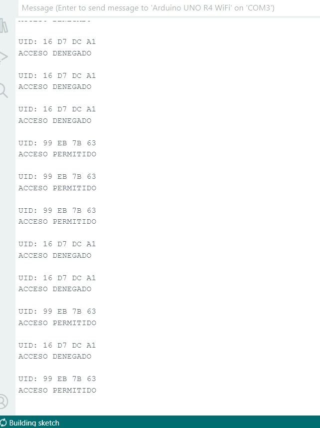
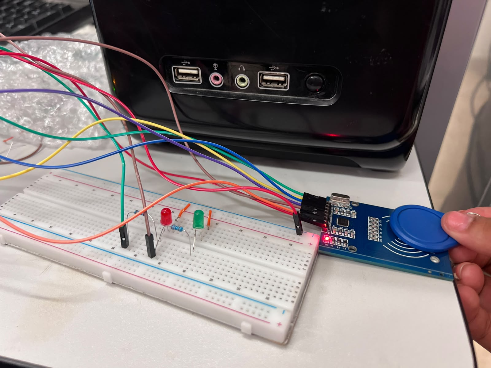

# Control de acceso con lector RFID RC522 por bus SPI

**Arduino UNO R4 WiFi + módulo RC522 (13.56 MHz)**

---

## Descripción

El proyecto conecta un lector RFID RC522 a un Arduino UNO R4 WiFi mediante el bus SPI para simular un control de acceso. El programa:

- Verifica al arrancar que hay comunicación con el lector (lee su registro de versión).
- Lee el UID de cada llavero y lo muestra en el Monitor Serie en hexadecimal (por ejemplo, `UID: 99 EB 7B 63`).
- Compara el UID con el autorizado, que está guardado en el código.
- Si coincide, muestra `ACCESO PERMITIDO` y enciende el LED verde 2 segundos. Si no, muestra `ACCESO DENEGADO` y enciende el LED rojo.
- Controla el tiempo de los LEDs con `millis()`, sin usar `delay()`, así que sigue leyendo etiquetas mientras un LED está encendido.
- Cada 5 s revisa que el lector siga respondiendo y lo reconfigura solo si se reinició por una caída de voltaje.

## Estructura del repositorio

| Carpeta | Contenido |
|---|---|
| [`Codigo/`](Codigo/) | Programa de Arduino `control_acceso_rfid.ino` y captura del código (`codigo.jpeg`). |
| [`Diagrama/`](Diagrama/) | Diagrama de conexiones (`diagrama.jpeg`) y fotografías del montaje (`d1.jpeg`, `d2.jpeg`). |
| [`Reporte/`](Reporte/) | Reporte completo de la práctica en PDF (`Reporte_Control_Acceso_RFID.pdf`). |
| [`Video/`](Video/) | Enlace al video con el funcionamiento. |

## Material

- 1 Arduino UNO R4 WiFi y cable USB
- 1 módulo lector RFID RC522
- 2 llaveros RFID de 13.56 MHz
- 1 LED verde y 1 LED rojo, cada uno con su resistencia limitadora (220 Ω)
- 1 protoboard y cables de conexión (jumpers)

**Software:** Arduino IDE 2, librería SPI (incluida) y librería **MFRC522** de *GithubCommunity* (se instala desde el Library Manager). Monitor Serie a **9600 baudios**.

## Conexiones

> **Importante:** el RC522 se alimenta con **3.3 V**. Conectarlo a 5 V puede dañarlo.

| Pin del módulo | Pin del Arduino | Función |
|---|---|---|
| SDA (SS) | D10 | Selección del lector (Chip Select, activo en bajo) |
| SCK | D13 | Reloj del bus SPI |
| MOSI | D11 | Datos del Arduino al lector |
| MISO | D12 | Datos del lector al Arduino (versión, UID, estado) |
| IRQ | — | No se utiliza |
| GND | GND | Tierra común |
| RST | D9 | Reinicio por hardware |
| 3.3V | 3.3V | Alimentación |
| LED verde | D7 | Acceso permitido |
| LED rojo | D6 | Acceso denegado |

Los cátodos de los LEDs van a GND.


## Cómo usarlo

1. Arma el circuito según el diagrama y la tabla de conexiones.
2. En el Arduino IDE instala la librería **MFRC522** (*Sketch > Include Library > Manage Libraries*).
3. Abre `Codigo/control_acceso_rfid.ino`, selecciona la placa **Arduino UNO R4 WiFi** y el puerto correcto, y súbelo.
4. Abre el Monitor Serie a 9600 baudios. Debe aparecer `Comunicacion OK con el lector RC522.`
5. Acerca tu llavero al lector y anota el UID que se muestra.
6. Para autorizar tu propio llavero, cambia este arreglo en el código y vuelve a subir el programa:

   ```cpp
   byte uidAutorizado[] = {0x99, 0xEB, 0x7B, 0x63};
   ```

Si el Monitor Serie muestra `ERROR: No hay comunicacion con el lector RC522`, revisa las líneas SPI (D10 a D13), la alimentación de 3.3 V y GND.

## Resultados

Se probaron dos llaveros iguales, que el lector distingue por su UID:

| Etiqueta | UID | Resultado | LED |
|---|---|---|---|
| Llavero 1 (autorizado) | `99 EB 7B 63` | ACCESO PERMITIDO | Verde, 2 s |
| Llavero 2 | `16 D7 DC A1` | ACCESO DENEGADO | Rojo, 2 s |

**Monitor Serie durante las pruebas:**



**Circuito en funcionamiento:**

| Llavero no autorizado (LED rojo) | Llavero autorizado (LED verde) |
|---|---|
|  |  |

## Video

Enlace al video del funcionamiento: [Ver en YouTube](https://youtu.be/o6up5xnkzOA)

## Reporte

El reporte completo incluye introducción, objetivos, desarrollo, análisis de resultados, cuestionario, conclusiones individuales y referencias: [`Reporte/Reporte_Control_Acceso_RFID.pdf`](Reporte/Reporte_Control_Acceso_RFID.pdf).

