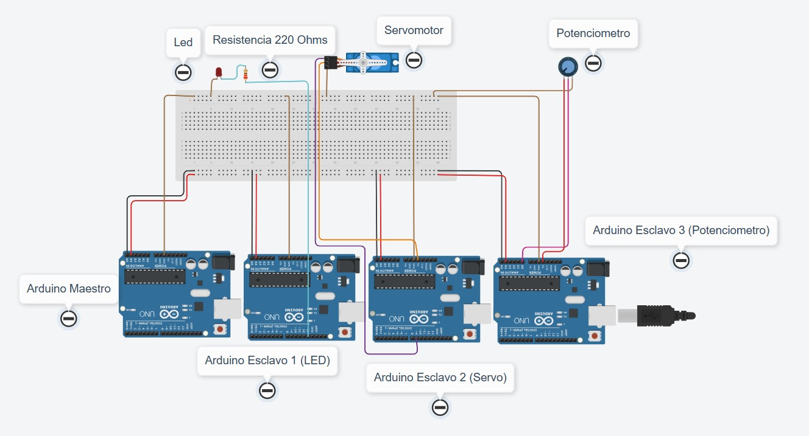
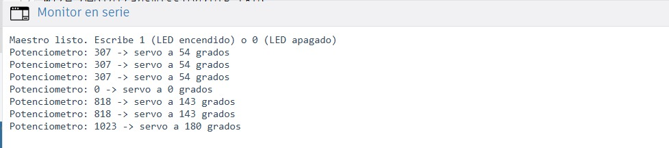

# Protocolo I2C entre 4 Arduinos

Práctica de Sistemas Programables sobre comunicación I2C entre un Arduino maestro y tres Arduinos esclavos.

## Contenido de la carpeta

| Carpeta | Contenido |
|---|---|
| [`Codigo/`](./Codigo) | Programas .ino del maestro (R3 y R4 WiFi) y de los tres esclavos |
| [`Diagrama/`](./Diagrama) | Imagen del diagrama de conexión del circuito |
| [`Reporte/`](./Reporte) | Reporte de la práctica en PDF |
| [`Video/`](./Video) | Enlace al video de la práctica funcionando |

## Diagrama de conexión

## Montaje físico

## Glosario de archivos — Codigo/

| Archivo | Descripción |
|---|---|
| `Maestro_R3.ino` | Código del Arduino maestro para placas Uno R3. Pide el valor del potenciómetro al esclavo 3, lo convierte a ángulo y lo manda al esclavo 2; también envía órdenes de encendido/apagado al esclavo 1 desde el Monitor serie |
| `Maestro_R4_WiFi.ino` | Misma lógica que el anterior, adaptada para Arduino Uno R4 WiFi (espera al puerto serie USB antes de imprimir) |
| `Esclavo1_LED.ino` | Esclavo con dirección `0x08`. Recibe una orden (1 o 0) y enciende o apaga un LED |
| `Esclavo2_Servo.ino` | Esclavo con dirección `0x09`. Recibe un ángulo (0°–180°) y mueve un servomotor a esa posición |
| `Esclavo3_Potenciometro.ino` | Esclavo con dirección `0x0A`. Lee un potenciómetro y envía su valor al maestro cuando este lo solicita |
| `Terminal.jpeg` | Captura del Monitor serie mostrando las lecturas del potenciómetro y el ángulo enviado al servo |

### Monitor serie

## Glosario de términos

- **I2C (Inter-Integrated Circuit):** protocolo de comunicación que permite conectar varios dispositivos usando solo dos líneas de datos.
- **SDA (Serial Data):** línea por donde viajan los datos del bus I2C.
- **SCL (Serial Clock):** línea de reloj que sincroniza el envío de los datos.
- **Maestro:** dispositivo que controla la comunicación; decide con quién habla y cuándo.
- **Esclavo:** dispositivo que solo responde cuando el maestro lo llama, identificado por una dirección única.
- **Dirección I2C:** número que identifica a cada esclavo en el bus (en esta práctica: `0x08`, `0x09` y `0x0A`).
- **NACK:** respuesta que indica que un esclavo no contestó a la comunicación del maestro.
- **`Wire.h`:** librería de Arduino usada para la comunicación I2C.
- **`millis()`:** función usada en el maestro para manejar tiempos sin bloquear el programa (a diferencia de `delay()`).

## Video

Enlace del video de la práctica: incluido en [`Video/README.md`](./Video/README.md)

## Reporte

Reporte completo de la práctica: [`Reporte/Reporte_I2C_4_Arduinos.pdf`](./Reporte/Reporte_I2C_4_Arduinos.pdf)
