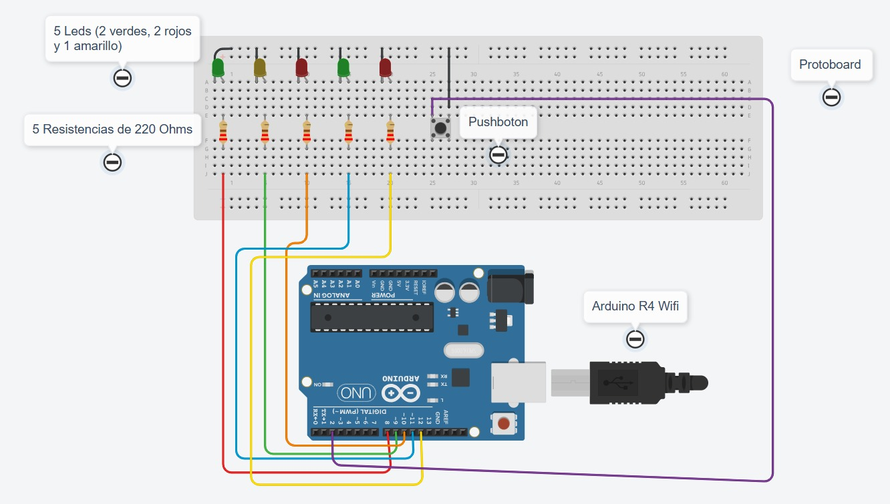
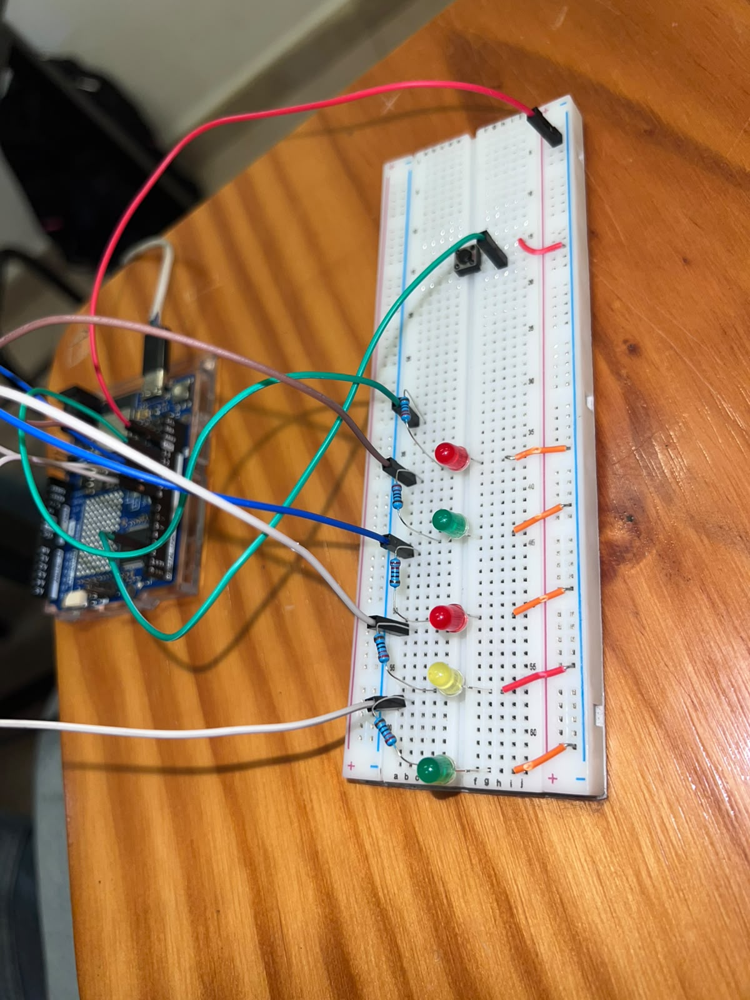

# Semáforo con cruce peatonal

Semáforo vehicular de tres luces con cruce peatonal controlado por pushbotón, usando Arduino UNO R4 WiFi.

## Descripción

Programa creado en **Arduino IDE** para el Arduino UNO R4 WiFi que controla un semáforo vehicular (verde, amarillo y rojo) y uno peatonal (rojo y verde) mediante cinco LED. Un pushbotón permite solicitar el cruce peatonal, el cual se habilita durante la fase roja del semáforo vehicular.

## Objetivos de aprendizaje

Programar salidas digitales y temporización sin bloqueo con `millis()`, leer una entrada digital con antirrebote y coordinar dos ciclos de luces dependientes entre sí.

## Material utilizado

- Arduino UNO R4 WiFi y cable USB.
- 5 LED (2 rojos, 2 verdes y 1 amarillo).
- 5 resistencias de 220 Ω.
- Pushbotón.
- Protoboard.
- Cables Dupont.

## Diagrama del circuito

Diagrama de referencia para la distribución de los cinco LED, las resistencias y el pushbotón.

## Código

- [Programa de Arduino](Codigo/Semaforo_Peatonal.ino).

| Elemento | Pin | Función |
|---|---|---|
| LED rojo peatonal | 12 | Indica que los peatones deben esperar |
| LED verde peatonal | 11 | Autoriza el cruce durante el rojo vehicular |
| LED rojo vehicular | 10 | Detiene el tránsito durante 6 segundos |
| LED amarillo vehicular | 9 | Indica la transición durante 2 segundos |
| LED verde vehicular | 8 | Permite el tránsito durante 6 segundos |
| Pushbotón | 2 | Registra una solicitud de cruce peatonal (`INPUT_PULLUP`) |

El botón se lee de forma continua con un filtro de antirrebote de 40 ms. Una pulsación válida durante el verde o el amarillo guarda la solicitud de cruce; las pulsaciones durante el rojo se ignoran.

## Evidencias de armado

- [Distribución de los LED y el pushbotón en protoboard](Diagrama/sem2.jpg).
- [Conexión de los cables con el Arduino UNO R4 WiFi](Diagrama/semaforo.jpg).

## Reporte

[Reporte_Practica_Semaforo_Cruce_Peatonal.pdf](Reporte/Reporte_Practica_Semaforo_Cruce_Peatonal.pdf)

Incluye:

- Objetivo, materiales y procedimiento.
- Tabla y gráfica de los tiempos programados del ciclo.
- Observaciones sobre el comportamiento del sistema.

## Conclusiones

La práctica permitió coordinar dos semáforos dependientes usando temporización no bloqueante con `millis()` y lectura de un botón con antirrebote por software. Se comprobó que la solicitud de cruce se conserva aunque se suelte el botón, y que solo se atiende una vez que inicia la fase roja vehicular, sin alterar la duración del ciclo.

## Resultados

El ciclo vehicular se repite cada 14 segundos (6 s verde, 2 s amarillo, 6 s rojo) sin desincronizarse. Mientras el semáforo vehicular está en verde o amarillo, el peatonal permanece fijo en rojo. Si se registró una solicitud durante esas fases, al iniciar el rojo vehicular se enciende el verde peatonal durante los mismos 6 segundos; de lo contrario, el rojo peatonal continúa encendido. Al terminar el rojo, el ciclo reinicia y queda lista una nueva solicitud.

| Fase vehicular | Duración | Peatón sin solicitud | Peatón con solicitud |
|---|---|---|---|
| Verde (pin 8) | 6 s | Rojo (pin 12) | Rojo (pin 12) |
| Amarillo (pin 9) | 2 s | Rojo (pin 12) | Rojo (pin 12) |
| Rojo (pin 10) | 6 s | Rojo (pin 12) | Verde (pin 11) |
| Ciclo completo | 14 s | Espera continua | Cruce de 6 s |

Estos valores corresponden a los tiempos programados, no a mediciones con cronómetro.

- [Resultados de la práctica.pdf](Resultados/ResultadosPSP.pdf).

